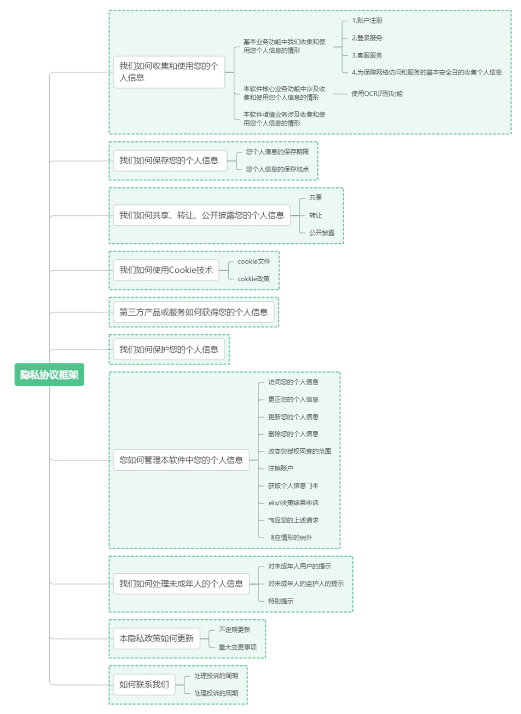

# 团子翻译器隐私政策

> 以下内容同时适用于 PC端 《**团子翻译器**》，以及 Android端 《**团子漫画翻译**》

《团子翻译器隐私政策》版本管理记录：

|文档名称|版本号|时间|修订内容|
| :-: | :-: | :-: | :-: |
|

团子翻译隐私政策

|v1.0|2024年9月10日|初稿|
|

团子翻译隐私政策

|v1.0|2024年10月14日|增加《隐私政策框架》图|

版本编号：v1.0

编制时间：2024年9月10日

团子翻译器-隐私政策

团子翻译器（以下简称“本软件”）系由泉州市星河云计算有限公司公司（注册地址：福建省泉州市南安市柳城街道金街社区柳南中路155号三楼，以下简称“本公司”）研发的一款基于OCR和翻译功能的实时屏幕区域翻译软件。我们非常重视保护用户的个人信息和隐私。您在注册、登录和使用本软件时，我们会在团子翻译器用户协议和隐私政策等一揽子协议约定下，收集、使用、保存、共享您的相关个人信息。为呈现我们处理您个人信息的情况，我们特制定《团子翻译器隐私政策》（以下简称“隐私政策”），我们承诺严格按照本隐私政策处理您的个人信息。您可以通过以下隐私政策框架快速了解本隐私政策有关内容。

在您注册登录本软件前，请您务必认真阅读本隐私政策，充分理解各条款内容。若您为未成年人（未满18周岁），请您务必在获得您监护人同意、在您监护人的监护和指导下，认真阅读本隐私政策，在您监护人充分理解并同意包含本隐私政策在内的团子翻译器一揽子协议内容后，方可使用本软件。您知晓并确认，当您勾选或点击“同意”本隐私政策，即表示您同意按照本隐私政策处理您的个人信息。本隐私政策适用范围包括本软件的的PC版本、安卓版本。

本隐私政策将帮助您了解以下内容（以下即为本软件的隐私政策框架）：

## 一、 我们如何收集和使用您的个人信息

请您充分理解并注意，本软件可能需要开启部分权限并收集必要的个人信息才能得以实现部分服务。您可以通过查询《个人信息收集清单》及《应用权限说明》快速了解本软件在特定业务功能/场景下为实现相应目的而收集的个人信息及调用的权限。

**（一） 基本业务功能中我们收集和使用您个人信息的情形**

1. 账号注册

当您注册本软件账号时，我们按照最少且必要原则收集您的个人信息。我们收集您的该些信息是为了帮助您完成本软件的账号注册，保护您的账号安全，在您需要时可以找回您的账号。如您不提供这类信息，我们将无法为您创建并正常向您提供本软件相关服务。

您还可以根据您的自身需求选择向我们提供您的昵称、绑定您的微信账号、电子邮箱以完善您的个人资料，请您注意，您不提供这些信息并不影响您正常使用本软件相关服务。

2.登录服务

当您使用一键登录服务时，电信运营商会通过中移SDK将您的手机号码发送给我们，中移SDK会收集您的IP 地址、软硬件特征信息、用户标识符（IMSI）、SIM卡标识，我们收集上述信息是为了帮助您完成一键登录，如您不同意我们收集这类信息，本软件可能因无法识别您的手机号而无法实现一键登录，但不影响您正常使用我们的其他服务。

3. 客服服务

（1）商业化咨询：当您如要将本软件进行商业化使用时，我们提供了客服联络方式，我们需要收集您填写的企业名称、企业所属行业、您的姓名、手机号码、电子邮箱、计划使用的领域、产品（选填）。我们收集您的上述信息是为了了解您的使用需求、与您取得联系并反馈您的咨询。如您不提供这类信息，我们将无法收到您的咨询信息，但不影响您继续非商业化使用本软件。

（2）客户投诉、建议或反馈：在您通过向我们提出投诉、建议或进行反馈时，为便于与您联系、尽快帮助您解决问题或记录相关问题的处理方案及结果，我们可能会收集您与我们的通信或通话记录、您提供的账号信息、您提供的联系方式信息、您为了证明相关事实提供的信息。如您选择上传图片，我们需要调用您设备的相机或存储权限，以获取您上传的图片。我们收集上述信息是为了完成客户服务，如您不提供这类信息，您的投诉、建议和反馈可能无法得到及时、有效处理，但不影响您正常使用我们的其他服务。

（3）如您在使用本软件过程中对隐私政策有任何疑问或需要我们协助的，我们欢迎您与我们的客户权益保障专员联系寻求协助，客户权益保障专员联络方式：contact@stariver.org 。

4.为保障数据安全目的收集个人信息

我们致力于为您提供安全、可信的产品与使用环境，提供优质而可靠的服务与信息是我们的核心目标。为了维护相关产品或服务的正常稳定运行，保护您或其他用户或公众的安全及合法利益，我们会收集如下必要信息，如您不同意我们收集以下信息，可能因无法完成安全风控验证而不能正常使用我们的服务：

（1）收集设备识别符：为了保障您账号、网络访问和服务的基本安全，我们需要收集您的唯一设备识别符（MEID、AndroidID、OAID、UUID、GAID）、国家、城市、IP地址、接入网络的方式、网络质量数据。

2. 收集软件安装列表等信息：为了预防恶意程序、保障运营质量及效率，我们需要调用您设备正在运行的应用程序的进程权限，以便于查询本软件是否为主运行程序；我们需要收集您的软件安装列表、您的网络行为轨迹（包括点击次数、参与时间）、访问日期和时间、服务日志信息、本软件的注册账号ID、读写 SDCard 卡数据。本软件系统在日常软件运行监测过程中，检测到软件运行异常和出现崩溃时，为排查问题可能需要获取必要的运行数据和崩溃数据，获取的该些数据经脱敏后上传至遥测服务器进行核查。

   （3）收集账号信息：为了判断账号安全、交易安全、识别违法违规情况、检测及防范安全事件，我们会收集您的账号信息、设备信息（浏览器/WebView类型，设备类型和型号，CPU，系统语言，内存，操作系统版本，Wi-Fi状态，时间戳和区域），进行数据分析，依法采取必要的记录、分析、处置措施。

   （二）本软件核心业务功能中涉及收集和使用您个人信息的情形

1. 使用ORC识别功能

当您使用OCR识别功能时，我们需要调用您的相机、存储和剪切板权限，我们调用您的相机、存储权限是为了获取您主动拍摄或选择的图片或文档资料，我们调用您的剪贴板权限是为了方便您直接选择识别已复制到剪贴板的图片或文档资料，我们获取您的上述信息是为了协助您实现OCR识别、文档命名和内容编辑功能，如您拒绝开启相应权限，我们将无法为您提供OCR识别功能。以下内容请您充分理解和注意：
（1）您识别的图片或文档资料中包含个人敏感信息，我们仅按照您的选择进行识别，不对识别后的结果进行其他处理。即使您已同意开启相机、设备存储权限，也仅会在您主动拍摄的照片或选择的文档范围内处理相关信息；如您未选择识别剪切板内容，我们不会读取您剪切板的内容进行相关处理。
（2）当您使用OCR翻译服务时，我们需要调用您设备的存储权限，我们需要将您图片中识别出来的文字上传给本软件翻译API。我们收集上述信息是为了完成翻译服务，如您不提供这类信息，我们将无法正常向您提供翻译服务。

2、关于翻译数据或翻译记录的储存

本软件的PC版本有翻译历史记录相关的功能，**请您充分理解并注意，**本软件的PC版本运营过程中，用户的翻译内容以SQLite本地数据库的形式保存在用户本地，PC端软件将在本地保存您所使用的翻译引擎、原文与译文，本公司不对用户客户端保留的数据完整性与一致性作任何承诺。

3、翻译数据或翻译记录的查询

通过PC端软件主页面从右至左第四个选项翻译历史 / TransHistory进入历史内容查询页面，页面中可对翻译历史进行查询、删改。

（三）本软件增值业务涉及收集和使用您个人信息的情形

本软件安卓版本具有分享互动的功能，在用户同意并选择使用该分享功能时会收集并使用您个人信息。

（四）依法豁免征得同意处理个人信息的情形

请您充分理解并注意，在下列情形中，根据中华人民共和国法律法规，我们处理您的个人信息无需征得您的授权同意。

1. 根据您的要求订立或履行合同所必需处理您的个人信息的情形；

2. 为履行法定职责或者法定义务所必需，例如与国家安全、国防安全、与刑事侦查、起诉、审判和判决执行等直接相关的法定职责或者法定义务；

3. 为应对突发公共卫生事件，或者紧急情况下为保护自然人的生命健康和财产安全所必需；

4. 为公共利益实施新闻报道、舆论监督等行为，在合理的范围内处理个人信息；

5. 在合理的范围内处理你自行公开的个人信息，或者其他已经合法公开的个人信息（如合法的新闻报道、政府信息公开等渠道合法公开的个人信息）；

6. 法律法规规定的其他情形。

特别说明：根据中国法律规定，如信息无法单独或结合其他信息识别到特定个人的，该些信息不视为个人信息。当您的信息可以单独或结合其他信息识别到您身份时，您的个人信息将按照本隐私政策进行保护。

## 二、 我们如何保存您的个人信息

1.保存期限

我们将在本隐私政策载明的目的所需的最短保存期限之内，保存您的个人信息，除非法律法规另有规定，或您向我们另行授权延长保存期限。前述期限届满后，我们将对您的个人信息做删除或匿名化处理。

2.保存地点

我们将您的个人信息保存在中国大陆境内。

## 三、 我们如何共享、转让、公开披露您的个人信息

1. 共享

您同意我们为向您提供服务而向支持我们功能的关联方及我们为向您提供服务集成或接入的第三方（详见团子翻译器一揽子协议《第三方信息数据共享清单》）共享您的个人信息。这些支持包括为我们提供基础设施技术服务、支付服务、数据处理，支持我们功能的关联方无权将您的个人信息用于与本隐私政策所载明的目的无关的其他用途；如要改变个人信息的处理目的，他们将另行征得您的授权同意。除关联方及本隐私政策明确的第三方外，我们目前不会将您的个人信息共享给其他方，如需将您的个人信息共享给其他方，我们会另行征求您的同意。

2. 转让

我们不会将您的个人信息转让给任何公司、组织和个人，但在涉及合并、收购或破产清算时，如涉及到个人信息转让，我们会向您告知，并要求新的持有您个人信息的公司、组织继续受此个人信息保护政策的约束，否则我们将要求该公司、组织重新向您征求授权同意。

3. 公开披露

我们仅会在另行获得您明确同意，或基于法律规定，或行政机关或司法机关的合法要求时，公开披露您的个人信息。

根据法律规定、行政机关或司法机关的要求所必须提供您个人信息的情况下，我们可能会依据所要求的个人信息类型和披露方式公开披露您的个人信息。在符合法律的前提下，当我们收到上述披露信息的要求时，我们会要求必须出具与之相应的法律文件，如传票或调查函。我们将对所有的要求都进行慎重的审查，以确保其具备合法依据，且仅限于执法部门因特定调查目的且有合法权力获取的数据。

## 四、 我们如何使用Cookie技术

1. cookie文件：当您使用本软件网站时，为您获得更轻松的访问体验，我们会在您的终端设备上存储名为 Cookie的小数据文件。Cookie 通常包含标识符、站点名称以及一些号码和字符。借助于Cookie，网站能够存储您的登录记录。我们向您发送Cookie是为了简化您重复登录的步骤。

2. cookie政策：我们不会将 Cookie 用于本隐私政策所述目的之外的任何用途。您可根据自己的偏好管理或删除Cookies。有关详情，请参见 https://www.aboutcookies.org/。您可以清除计算机上保存的所有Cookie，大部分网络浏览器都设有阻止 Cookies 的功能。但如果您这么做，则需要在每一次访问我们的网站时更改用户设置，而且您之前所记录的相应信息也均会被删除，并且可能会对您所使用服务的安全性有一定影响。如需详细了解如何更改浏览器设置，请访问您使用的浏览器的相关设置页面。

## 五、 第三方产品或服务如何获得您的个人信息

您同意并理解，为了更好地提供服务，我们的产品可能会集成或接入第三方服务，包括SDK、API或H5。为使您可以更好地了解第三方服务类型和接入方式，您可以查看《第三方信息数据共享清单》以进一步了解。

## 六、 我们如何保护您的个人信息

我们非常重视用户个人信息的安全。为此，我们采取了行业通行的数据保护技术与管理措施，例如网络隔离、数据加密、访问控制、身份鉴权、恶意代码防范、安全审计等措施。

请您知悉，虽然我们依法采取了合理的措施保护您的信息，但没有任何系统或网络是绝对安全的。如果我们的物理、技术或管理防护设施遭到破坏，导致信息被非授权访问、公开披露、篡改、或毁坏，导致您的合法权益受损，我们将在法律规定的范围内承担责任，我们也将尽最大努力追究侵权人的法律责任，同时希望您尽最大努力配合我们的工作。

在发生个人信息安全事件后，我们将按照法律法规的要求向您告知：安全事件的基本情况和可能的影响、我们已采取或将要采取的处置措施、您可自主防范和降低风险的建议、对您的补救措施等。事件相关情况我们将以邮件、信函、电话、推送通知等方式告知您，难以逐一告知个人信息主体时，我们会采取合理、有效的方式发布公告。同时，我们还将按照监管部门要求，上报个人信息安全事件的处置情况。

为保护您的用户合法权益，本软件设置了客户权益保障专员，除专门处理个人信息安全责任相关事项，您在使用本软件服务过程中遇到问题，您可以与客户权益保障专员联系核实处理，客户权益保障专员的联系邮箱：<contact@stariver.org> 。

## 七、 您如何管理本软件中您的个人信息

在您使用本软件期间，您可以访问、更正、删除您的个人信息，以及行使改变授权同意的范围与注销账号的权利，您的意见会及时得到处理。

（一）访问您的个人信息

您有权访问您的个人信息，法律法规规定的例外情况除外。如果您想行使数据访问权，可以通过【我的】-【账号】进行访问。如果您无法自行访问您的个人信息，请我们客户权益保障专员进行核实，我们将在收到您的反馈后十四日内进行处理。

（二）更正您的个人信息

当您发现我们处理的关于您的个人信息有错误时，您有权要求我们作出更正。您可以通过【我的】-【账号】自行更正，也可以客户权益保障专员要求我们更正，我们将在收到您的请求后十四日内进行处理。

（三）更新您的个人信息

您有权更新您的个人信息。如您需更换账号绑定的手机号码、微信号码、邮箱、密码，请通过【我的】页面自行更改或联系客户权益保障专员协助更改，我们将在收到请求的十四日内进行处理。

（四） 删除您的个人信息

如果您无法自行删除您的个人信息，或使用“注销账号”功能出现困难，请与我们客户权益保障专员联系删除，我们将在收到请求的十四日内进行处理。客户权益保障专员联系邮箱：<contact@stariver.org> 。

在以下情形中，您可以向我们提出删除个人信息的请求，若我们决定响应您的删除请求，我们还将根据法律法规和标准文件的规定，同时通知从本公司获得您的个人信息的实体及时删除：

1、我们违反法律法规或与您的约定收集、使用、处理个人信息；

2、我们违反法律法规或违反与您的约定与第三方提供您的个人信息的情形，我们将立即停止向第三方提供您个人信息的，并通知第三方及时删除；

3、您不再使用我们的产品或服务，或您向我们提出了删除（注销）了账号，或我们终止服务及运营，我们根据一揽子协议的约定删除了您的账号。

当您从我们的服务中删除信息后，我们可能不会立即在备份系统中删除相应的信息，但会在备份更新时删除这些信息。

（五）改变您授权同意的范围

如您需改变已授权我们调用的设备权限范围，您可以通过您的移动设备【设置】-【应用权限】进行变更。您还可以通过本隐私政策载明的客户权益保障专员联络方式与我们联系，了解更多关于如何改变同意范围或撤回您的授权，我们将在收到请求的十四日内进行处理。

请您充分理解并注意，本软件可能需要开启部分权限并收集必要的个人信息才能得以实现部分服务。当您撤回您的同意时，我们可能将无法继续为您提供本软件部分服务，但不会影响此前基于您的授权已经开展的个人信息处理服务。

（六）删除（注销）账号

如您不再需要使用本软件，您可以直接卸载本软件。如您需要删除（注销）您注册使用的本软件账号，可以通过【我的】-【账号】-【注销账号】功能删除账号，或与我们客户权益保障专员联系提出删除的请求，我们将在收到请求的十四日内更具国家相关法律法规规定处理。

在您决定删除（注销）您账号之前，请您充分理解删除（注销）账号的操作是不可逆的，我们将停止为您提供产品或服务、不再收集您使用本服务所需要的数据和信息，并依据您的要求删除与您账号相关的个人信息或做匿名化处理，但法律法规另有规定或监管部门另有要求的除外。账号删除（注销）的指示已经收到，该指示不可撤销，本公司无法提供恢复账号的服务，账号删除后，如果您再次使用本软件的，您需要重新注册账号。

（七）获取个人信息副本

您可以通过本隐私政策载明的客户权益保障专员联络方式与我们联系，以获取您的个人信息副本，我们将在收到请求的十四日内进行处理。

（八）自动决策结果申诉

在某些业务功能中，我们可能仅依据信息系统、算法在内的非人工自动决策机制作出决定。如果这些决定显著影响您的合法权益，您有权通过本隐私政策载明的客户权益保障专员联络方式与我们联系，以要求我们作出解释或对信息系统自动决策结果进行投诉，我们将在收到请求的十四日内进行处理。

（九） 响应您的上述请求

如您无法按照上述方式行使权利的，您可以采取本隐私政策载明的联系方式与我们联系。为保障安全，您可能需要提供书面请求，或以其他方式证明您的身份。我们可能会先要求您验证自己的身份，然后再处理您的请求。我们将在收到请求的十四日内进行处理。

对于您的合理请求，我们原则上不收取费用，但对多次重复、超出合理限度的请求，我们将酌情收取一定成本费用。对于那些无端重复、需要过多技术手段、给他人合法权益带来风险或者非常不切实际的请求，我们可能会予以拒绝。

如果您的请求被拒绝，我们将告知您拒绝的原因，您可以通过本隐私政策载明的客户权益保障专员联系方式进行投诉。

（十）响应情形的例外

在以下情形中，我们将无法响应您的请求:

1、与我们履行法律法规规定的义务相关的；

2、与国家安全、国防安全直接相关的；

3、与公共安全、公共卫生、重大公共利益直接相关的；

4、与刑事侦查、起诉、审判和执行判决等直接相关的；

5、我们有充分证据表明个人信息主体存在主观恶意或滥用权利的；

6、出于维护个人信息主体或其他个人的生命、财产等重大合法权益但又很难得到本人同意的；

7、响应个人信息主体的请求将导致个人信息主体或其他个人、组织的合法权益受到严重损害的；

8、涉及商业秘密的。

## 八、 我们如何处理未成年人的个人信息

（一）如您为未成年人（即未满18周岁，下同），我们提示您理解：

1、我们的产品或服务主要面向成年人（即18周岁以上），并无专门面向未成年人（未满18周岁，下同）的产品和服务或产品和服务的部分功能板块，无需用户输入生日、年龄信息等用以识别用户年龄。我们非常重视对未成年人个人信息的保护，您在主动提供个人信息前，请加强个人保护意识并谨慎对待。您应在您的父母或其他监护人监督、指导下仔细阅读本隐私权政策，并在征得您的父母或其他监护人同意的前提下使用我们的服务或向我们提供信息。

2、您应遵守《全国青少年网络文明公约》，为更好地保护未成年人隐私权益，请您慎重上传包含未成年人姓名、肖像等内容，增强自护意识。请您充分理解并注意，我们仅为实现本隐私政策载明的目的处理您上传的内容，不作他用。

（二）如您是未成年人的监护人，我们提示您：

1、请您关注您所监护的未成年人是否是在取得您的授权同意之后使用我们的产品或服务、主动向我们提供个人信息，您作为监护人应指导并监督被监护人的使用行为；

2、请您保管好您的支付账号及支付密码等重要信息，以避免被监护人在未取得您同意的情况下在我们的产品或服务中进行支付结算；

3、如您所监护的未成年人在未获取您同意的情况下已点击同意本隐私政策、注册本软件账号，请与我们的客户权益保障专员联络删除（注销）账号。

4、如果您对您所监护的未成年人的个人信息有疑问，请通过本隐私政策载明的方式与我们联系。

（三）**特别地，若您是未成年人（即不满18周岁，下同），为保护未成年人个人信息，我们还发布了《未成年人隐私保护指引》。在您使用我们的产品或服务前，您及您的监护人还应仔细阅读《未成年人隐私保护指引》。只有在取得监护人对《未成年人隐私保护指引》的同意后，您方可使用我们的产品或服务。**

## 九、本隐私政策如何更新

（一）不定期更新

我们的隐私政策可能会适时发生变更。我们会在本页面上发布对本隐私政策所做的任何变更。对于重大变更，我们会提供更为显著的通知（例如通过弹窗、滚动公屏等方式，公告隐私政策变更），对于重大变更事项，我们会以获得您确认同意作为使用本软件的前提。本隐私政策修订版、补充版一旦发布，本隐私政策内容与新发布版本内容不一致的，以新发布的版本内容为准。本公司保留最终解释权。

（二）重大变更事项

本隐私政策所指的重大变更包括但不限于:

1、我们的服务模式发生重大变化（如处理个人信息的目的、处理的个人信息类型、个人信息的使用方式和范围等发生变化）；

2、个人信息共享、转让或公开披露的主要对象发生变化；

3、您参与个人信息处理方面的权利及其行使方式发生重大变化；

4、我们负责处理个人信息安全的责任部门、联络方式及投诉渠道发生变化；

5、个人信息安全影响评估报告表明存在高风险时。

## 十、 如何联系客户权益保障专员

（一）客户权益保障专员联络方式

如果您对本隐私政策或个人信息保护有任何疑问、咨询、意见、建议或投诉，或您在使用本软件过程中遇到问题需要协助，您可以通过以下方式与我们客户权益保障专员联系：

客户权益保障专员邮箱：<contact@stariver.org> 。

（二）处理投诉的周期

我们收到您的问题、意见或建议，并验证您的用户身份后，我们将在十四日内回复。如果您对我们的回复不满意，特别是我们的个人信息处理行为损害了您的合法权益，您还可以向网信、电信、公安及工商等监管部门进行反映或投诉。