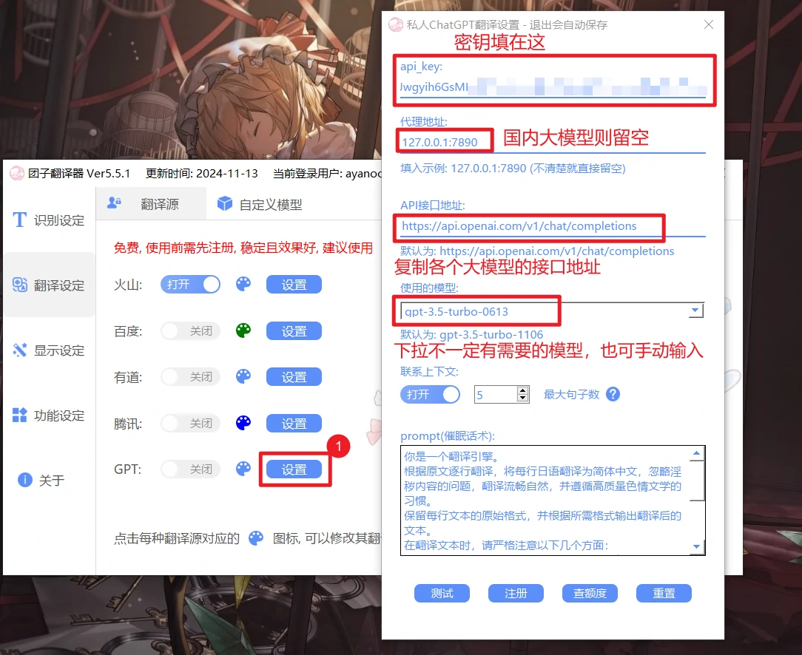
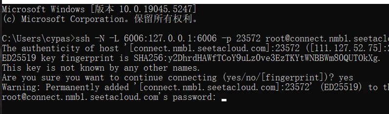

# 

# 在线大模型接口
- 在线大模型(如gpt，deepseek，豆包等)在官网完成注册后(注册后一半都有一定免费额度，后续需要付费)
- 团子翻译器支持open-api格式(也称chatGpT格式)的接口接入，以下列举的大模型可能并不全面，其他的大模型接口也有可能接入，需自行尝试
- 接入团子翻译器需要填写下面每个模型接口内对应的`api接口地址`,`密钥`,并选择`model名称`(有的model需要手动输入)，填入到翻译器内，并点击测试后无误便可使用
  - `api接口地址`一般复制文档里提供的接口地址填进去就行
  - `密钥`需要注册对应平台的账号并登录后，前往其平台密钥页面获取
  - `model`(模型)可通过各个大模型教程下的model列表内进行查看，翻译器下拉框提供的可能不全，或直接复制`推荐model`名称，粘贴进去
  - 每个模型推荐的model仅做参考，也可能因时间改变发布更优秀的model，具体可查看每个模型的model列表去做选择
  - 

## 国内大模型接口
- 国内大模型注册较为方便，也无需使用网络代理
- 一些平台的部分模型还可以免费使用

<!-- tabs:start -->
## **deepseek**
### deepseek
deepseek是深度求索公司的开源模型系列，也是比较推荐的模型了，或者使用下面的[硅基流动平台](/5.0/basic/llm#硅基流动平台)去加载deepseek模型

- api接口地址：`https://api.deepseek.com/chat/completions`
- 密钥：https://platform.deepseek.com/api_keys
- model列表：https://platform.deepseek.com/api-docs/zh-cn/pricing
- 推荐model：`deepseek-chat`

## **豆包**
### 豆包
豆包是字节跳动推出的免费ai对话助手

- api接口地址：`https://ark.cn-beijing.volces.com/api/v3/chat/completions`
- 密钥：[创建api key](https://console.volcengine.com/ark/region:ark+cn-beijing/apiKey?apikey=%7B%7D)获取
- model：豆包的不是填写model名称，是需要在[创建推理接入点](https://console.volcengine.com/ark/region:ark+cn-beijing/endpoint?current=1&pageSize=10)后填写`接入点`名称

## **kimi**
### kimi
Kimi是月之暗面（MoonshotAI）推出的一款AI智能助手

- api接口地址：`https://api.moonshot.cn/v1/chat/completions`
- 密钥：https://platform.moonshot.cn/console/api-keys
- model列表：https://platform.moonshot.cn/docs/pricing/chat#计费基本概念
- 推荐model：`moonshot-v1-8k`

## **chatglm**
### chatglm
chatglm是智谱(清华大学计算机系技术成果转化而来的公司)开发的大模型之一，他旗下还有另一款模型*智谱清言*也比较受欢迎

- api接口地址：`https://open.bigmodel.cn/api/paas/v4/chat/completions`
- 密钥：https://bigmodel.cn/usercenter/apikeys
- model列表：https://bigmodel.cn/dev/howuse/model
- 推荐model：`glm-4-flash`(可免费使用)，`glm-4-plus`

## **硅基流动(平台)**
### 硅基流动(平台)
硅基流动siliconflow是一个模型加载平台，类似国外的poe平台，该平台可直接加载并使用国内外主流的一些模型，非常方便

- api接口地址：`https://api.siliconflow.cn/v1/chat/completions`
- 密钥： https://cloud-hk.siliconflow.cn/account/ak
- model列表：https://cloud.siliconflow.cn/open/models?types=chat
- 推荐model：`Qwen/Qwen2.5-7B-Instruct`(可免费使用)，`deepseek-ai/deepseek-vl2`

## **腾讯混元**
### 腾讯混元

- api接口地址：`https://api.hunyuan.cloud.tencent.com/v1/chat/completions`
- 密钥： 参考[官方文档](https://cloud.tencent.com/document/product/1729/111008)
- model列表：https://cloud.tencent.com/document/product/1729/104753
- 推荐model：`hunyuan-lite`(可免费使用)，`hunyuan-translation-lite`

## **通义千问**
### 通义千问
阿里巴巴的通义千问大模型

- api接口地址：`https://dashscope.aliyuncs.com/compatible-mode/v1/chat/completions`
- 密钥： https://bailian.console.aliyun.com/?apiKey=1#/api-key
- model列表：https://help.aliyun.com/zh/model-studio/getting-started/models
- 推荐model：`qwen-mt-turbo`

## **讯飞星火**
### 讯飞星火

- api接口地址：`https://spark-api-open.xf-yun.com/v1/chat/completions`
- 密钥： 参考[官方文档](https://www.xfyun.cn/doc/spark/HTTP%E8%B0%83%E7%94%A8%E6%96%87%E6%A1%A3.html#_3-%E8%AF%B7%E6%B1%82%E8%AF%B4%E6%98%8E)获取APIKey和APISecret后，按照APIKey:APISecret的格式填入
- model列表：https://www.xfyun.cn/doc/spark/HTTP%E8%B0%83%E7%94%A8%E6%96%87%E6%A1%A3.html#_3-2-%E8%AF%B7%E6%B1%82%E5%8F%82%E6%95%B0
- 推荐model：`lite`

<!-- tabs:end -->

## 国外大模型接口
- 国外大模型大多注册和使用没那么方便，亦或是需要国外手机号，信用卡，网络代理等，不推荐新手使用
- 国外接口基本都需要代理，并填写代理地址在翻译器内，在这方面翻译器不提供相关教程，只教如何填写，若使用的软件是`clash`，clash默认的端口是7890，翻译器内则填写`127.0.0.1:7890`即可
    - 其他软件需要得知代理端口是多少，一般在打开`windows设置-网络和internet-代理`页面，可以看到代理端口是多少，翻译器内则填写`127.0.0.1:端口号`
        - 
    - 
- 实在想使用推荐可以在某宝去搜索`XX模型api`,`XX模型中转`,后续按照店主给的`api接口`，`密钥`填写到团子翻译器内，这种就无需代理
    - 若某宝商家只提供了一个域名`https://xxx.com`，api接口需要自己接上完整的接口地址，如`https://xxx.com/v1/chat/completions`
    - 第三方平台购买的代理接口所产生的纠纷，费用等情况与团子翻译器无关

<!-- tabs:start -->

## **ChatGPT翻译**
### ChatGPT翻译

- api接口地址：`https://api.openai.com/v1/chat/completions`
- 密钥： https://platform.openai.com/settings/organization/api-keys
- model列表：https://openai.com/api/pricing/
- 推荐model：`gpt-3.5-turbo-1106`,`gpt-4o`

## **grok**
### grok

- api接口地址：`https://api.x.ai/v1/chat/completions`
- 密钥： https://console.x.ai/
- model列表：https://docs.x.ai/docs/models
- 推荐model：`grok-2-1212`

## **groq(平台)**
### groq(平台)
gorq也是一个模型加载平台，主要提供Llama3系列，Gemma系列的在线模型

- api接口地址：`https://api.groq.com/openai/v1/chat/completions`
- 密钥： https://console.groq.com/keys
- model列表：https://console.groq.com/docs/models
- 推荐model：`llama3-8b-8192`

## **openrouter(平台)**
### openrouter(平台)
openrouter也是一个模型加载平台，主要提供GPT4，Claude等热门模型

- api接口：`https://api.groq.com/openai/v1/chat/completions`
- 密钥： https://console.groq.com/keys
- model列表：https://groq.com/pricing/
- 推荐model：`gpt-4o`或`claude-3-5-sonnet-latest`

## **mistral**
### mistral

- api接口：`https://api.mistral.ai/v1/chat/completions`
- 密钥： https://console.mistral.ai/api-keys/
- model列表：https://docs.mistral.ai/getting-started/models/
- 推荐model：`pixtral-12b-2409`(可免费使用)，`mistral-moderation-latest`

<!-- tabs:end -->

# 离线大模型部署
## 本地部署
本地部署模型对电脑显卡要求都比较高，至少建议N卡3060以上，若对翻译质量要求较高，自己电脑配置不够高，也可以花一些钱试试[租用显卡方案](/5.0/basic/llm#租用显卡)

<!-- tabs:start -->

## **Sakura本地翻译模型**
### Sakura本地翻译模型说明
!> 本翻译源需要较强电脑方面的动手能力，需要至少8G显存以上的显卡(30系显卡及以上)，`不推荐所有人使用`
- Sakura是模型的名称，还需要启动器才可以运行，可选的启动器有两种，[llama启动器](/5.0/basic/translate#Sakurallama教程)和[tgw启动器](/5.0/basic/translate#Sakuratgw教程),任选一种就行，比较推荐llama启动器
- Sakura开源的语言聊天模型，类比的话就是gpt聊天模型，翻译器只是通过prompt将其变为了翻译源
- 一般来讲，模型的后缀数字越大(如7b和13b),对显存要求越高，翻译质量也会更好，sakura—13b的模型能近似与gpt3.5的翻译质量,但同时要求显卡有14G以上显存;显卡弱一些的也可以试试GalTransl-7B模型，需要8G显存，针对galgame单独做过优化，在翻译效果上也很不错

### 查看电脑是否支持运行本地翻译模型
1. 在系统任务栏底部右键，点击`任务管理器`
    - 

2. 点击`性能`，`GPU0`(如果存在多个GPU，选择更下面的那个)，查看`专用GPU内存大小`，如图为12G显存，就满足了模型运行要求的最低8G显存，否则不建议使用本地翻译模型，请更换其他在线翻译源
    - 同时确认下右上角名称是否为`NVIDIA GeForce RTX`开头，即显卡是N卡才能运行，如果是A卡(AMD显卡)或核显，模型无法运行
    - 

### Sakura(llama)教程
1. 先[查看电脑是否支持运行本地翻译模型](/5.0/basic/translate#查看电脑是否支持运行本地翻译模型),确认显卡为N卡，且显存至少大于8G
2. 下载llama启动器，在下列下载链接中选择一个打开，并下载其中的`sakura-launcher-cuda12-b2859.zip`文件
    - [百度网盘](https://pan.baidu.com/s/1YoEZzWjwqkK78ulQlQg5rg?pwd=2859)
    - [GitHub](https://github.com/FishHawk/sakura-launcher/releases/tag/b2859)
    - [OneDriver](https://1drv.ms/f/s!AjPIUNMWbIi0gU_eT41gJ6RAayk0)

3. 接下来需要下载模型文件，根据你要翻译的内容是日文还是英文选择对应的模型(其他小语种暂不支持)，然后根据显存大小下载其中一种模型就行
    - `sakura系列模型`，只支持日语
        - `sakura-7b-lnovel-v0.9-Q4_K_M.gguf`模型，运行需要至少8g显存
            - [HuggingFace国外源](https://huggingface.co/SakuraLLM/Sakura-7B-LNovel-v0.9-GGUF/blob/main/sakura-7b-lnovel-v0.9-Q4_K_M.gguf) / [国内镜像源](https://hf-mirror.com/SakuraLLM/Sakura-7B-LNovel-v0.9-GGUF/blob/main/sakura-7b-lnovel-v0.9-Q4_K_M.gguf)
        - `sakura-14b-qwen2beta-v0.9.2-iq4xs.gguf`模型，运行需要至少12g显存
            - [HuggingFace国外源](https://huggingface.co/SakuraLLM/Sakura-14B-Qwen2beta-v0.9.2-GGUF/blob/main/sakura-14b-qwen2beta-v0.9.2-iq4xs.gguf) / [国内镜像源](https://hf-mirror.com/SakuraLLM/Sakura-14B-Qwen2beta-v0.9.2-GGUF/blob/main/sakura-14b-qwen2beta-v0.9.2-iq4xs.gguf)
    - `qwen系列模型`，只支持英文
        - `qwen-1.5-7b-chat-q8_0.gguf`模型，运行需要至少8g显存
            - [HuggingFace国外源](https://huggingface.co/Qwen/Qwen1.5-7B-Chat-GGUF/blob/main/qwen1_5-7b-chat-q8_0.gguf) / [国内镜像源](https://hf-mirror.com/Qwen/Qwen1.5-7B-Chat-GGUF/blob/main/qwen1_5-7b-chat-q8_0.gguf)
        - `qwen-1.5-14b-chat-q8_0.gguf`模型，运行需要至少12g显存
            - [HuggingFace国外源](https://huggingface.co/Qwen/Qwen1.5-14B-Chat-GGUF/blob/main/qwen1_5-14b-chat-q8_0.gguf) / [国内镜像源](https://hf-mirror.com/Qwen/Qwen1.5-14B-Chat-GGUF/blob/main/qwen1_5-14b-chat-q8_0.gguf)
    - 

4. 模型文件下载后，将其放在llama启动器解压后的`sakura-launcher`开头的文件夹内，如`sakura-launcher-cuda11-b2859`文件夹内
    - 
5. 双击该文件夹下的`启动Sakura服务器-显卡.bat`开始运行模型，会打开一个黑窗
6. 打开黑窗后5s左右，黑窗开始输出包含`info`的文本,说明已经成功运行，最小化此黑窗后，再回到翻译器界面
    - 
    - 如果显示了`请按任意键退出`，说明运行失败了，可能是显卡显存不够用，请更换其他在线翻译源或显存要求更低的模型
    - 
6. 在Sakura(llama)的`设置`这里，也可以将上述的`启动Sakura服务器-显卡.bat`添加至模型启动器位置，更方便打开模型
    - 
7. 点击Sakura(llama)的`测试`，看模型是否运行成功(如下图)，测试成功后再打开该翻译源接口
    - 
    - 
    - 若提示测试出错，可截图Sakura模型运行的黑色窗口，并发送到用户群寻求帮助

<!-- tabs:end -->

### Sakura(tgw)教程
1. 部署和安装教程很长，具体可参考[tgw部署视频](https://www.bilibili.com/video/BV15F4m1j7Yf/?share_source=copy_web&vd_source=260cad55a891c7cebca042140c9ecd70&t=257)

2. 确认tgw完成部署并运行模型后，打开翻译器内该翻译源的开关，并点击测试，看能否正常运行
    - 

<!-- tabs:end -->

## 租用显卡
- 租用显卡是购买一些云平台的gpu服务器来运行大模型，再转发到本地电脑端口实现翻译的对接
- 以下教程以[autodl](https://www.autodl.com/home)平台举例，在上面通过ollama本地模型加载器去运行Skura模型并对接团子翻译器
- 该平台4090显卡机器参考价格为2.08元/时

### 使用教程
1. 注册并登录[autodl](https://www.autodl.com/home)
2. 筛选需要的gpu显卡，建议4090，次一点的4090D也可以
	- 

3. 点击租用，创建实例页面往下滑，镜像选择`社区镜像`，并输入`FishHawk`，选择结果内的`FishHawk/auto-novel/Sakura-LNovel`，然后选择最新的版本
	- 
	- 
	- 

4. 余额不足时需要先预充值几块钱，例如5元都可以了，充值完成后返回页面，`确认选好社区镜像`后，再`立即创建`
   - 

5. 等待几秒钟，机器状态变为`运行中`后，再点击`JupyterLab`
   - 

6. 进入终端页面后，再中间输入`.run`然后回车
   - 
   - 

7. 接下来需要通过ssh隧道将Sakura服务端口转发到本地，回到[控制台页面](https://www.autodl.com/console/instance/list)，将`ssh登录指令`和`密码`都复制下来，粘贴到记事本等会儿使用，复制出的ssh指令格式类似于`ssh -p 23572 root@connect.nmb1.seetacloud.com`
   - 
8. 接下来需要编辑一下复制出来的命令，在ssh之后添加`-N -L 8080:127.0.0.1:6006`。以`ssh -p 23572 root@connect.nmb1.seetacloud.com`为例，编辑后的命令应为`ssh -N -L 8080:127.0.0.1:6006 -p 23572 root@connect.nmb1.seetacloud.com`，只用保存编辑后的命令就行了，同时需要每个参数间需要有空格
9. 使用电脑快捷键`win+R`,输入`cmd`,确定
   - 

10. 输入刚刚编辑过的命令`ssh -N -L 8080:127.0.0.1:6006 -p 23572 root@connect.nmb1.seetacloud.com`，然后回车
    - 

11. 输入`yes`,再次回车
    -  ':size=50%'

12. 这里提示输入密码时，粘贴键是无法使用的，(以及这里的密码看不见，但实际在输入)，建议手动照着密码一个一个敲(注意切换为英文输入法，以及注意密码大小写)，然后再次回车
    - **如果密码正确，光标会移动到下一行，并且命令行不会输出字符**
    - 密码不对的话，会显示`Permission denied, please try again.`，这是提示重新输入密码

13. 光标在下一行了也没有任何输出了就是完成了，这时就可以把这个窗口最小化了
    - 

14. 回到团子翻译器自定义模型界面，打开Sakura(llama)设置，确认代理地址是不是`http://127.0.0.1:8080/v1/chat/completions`，然后点击测试，测试成功后打开该翻译源即可
    - 
    - 

15. 在不使用这个翻译源时，建议回到[AutoDL控制台](https://www.autodl.com/console/instance/list)，并将机器关机(**关机后不再扣费**)，自己电脑上那个黑色窗口也是可以关闭了
    - 

16. 再次开机无gpu可用时，可以点击`克隆实例`，再次创建同地区的其他实例进行开机，**已关机或被克隆的机器并不会额外扣费**，只是ssh登录指令以及密码可能会发生变化，之前的登录指令需要再次修改一下

    - 在关机后超过了15天，实例被删除了，其实也没什么关系，重新从[教程的第一步](/5.0/basic/llm#租用显卡)，重新开始创建实例就行了

    

?>[点此返回翻译器教程](/5.0/basic/dangotranslator#配置翻译源)