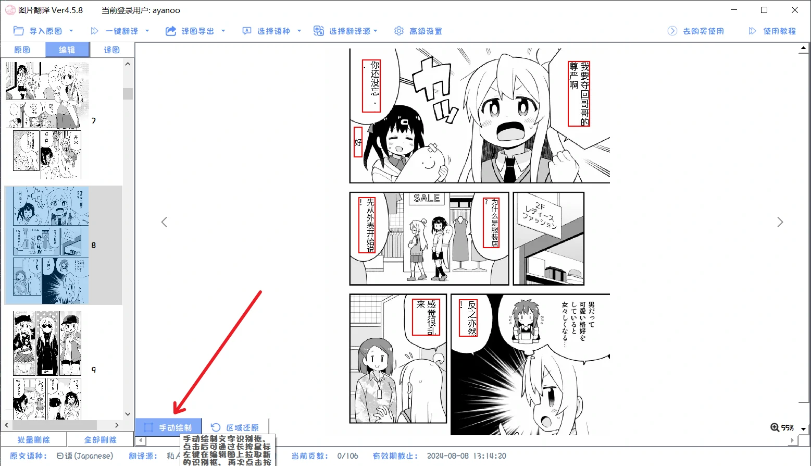
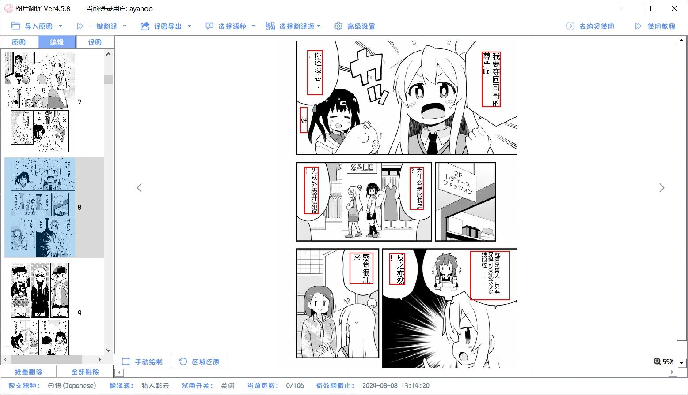

### 图片翻译
!> 此功能为单独收费功能，费用为`20元/月`，购买后配置一项翻译源即可，本功能不需要配置ocr
也可查看视频版教程->[图片翻译介绍](https://www.bilibili.com/video/BV1Ws4y1F7qd/)

## 使用教程
1. 图片翻译的入口在主面板的这里
   - 
2. 按需要可以选择不同的方式导入漫画，或将文件夹直接拖入左侧翻译区
   - 
3. 选择语种，目前支持`日语`,`英语`,`繁体中文`的图片翻译
   - 
4. 选择翻译源，翻译源具体配置见[翻译源设置](/5.0/basic/translate#翻译源的注册与使用)
   - 
5. 可以在高级设置中调整自己需要的字体，轮廓，颜色等参数，或是其他功能性的进一步渲染的设置，在其他设定页面也可以设置翻译器启动时直接打开漫画翻译，具体使用可查看[图片翻译高级设置](#高级设置)
   - 
6. 点击`一键翻译`后，选择`跳过已翻译的`，便会按照列表顺序对图片依次进行翻译，如果存在翻译失败的图片，也可以再重新点击`一键翻译`
   - 
   - 
7. 需要对图片的翻译进行二次润色的，可以切换到`编辑`标签栏，这里可以对进行更加细致的编辑，具体见[图片二次编辑](#图片二次编辑)
   - 
8. 如果有部分图片文字没有自动识别到的，可以点击左下角`手动绘制`来自定义框选识别区域，会在该区域上重新识别文字并渲染翻译;意外识别到的多余的选区，同样也可以点击左下角`区域还原`来还原为原图
   - 
   - 
9. 完成全部翻译后，可以切换到`译图`标签栏下进行浏览，键盘的`上/下 方向键`，可以用于图片的翻页，更多快捷键说明可以查看[快捷键说明](#快捷键说明)
10. 完成图片翻译后，也可以导出到指定目录或导出为压缩包
   - 

## 高级设置

### 样式设定

可以修改图片翻译贴图字体的颜色，描边样式，轮廓等

### 功能设定

默认设定一般不需要更改，需要注意的是

- 如果漫画为英文文本，还需要注意需要将渲染缩放调整`5.0`，日文为默认的1.0无需修改

- 
- 若贴图中出现了不想翻译的干扰性文本，可将文字识别置信度阈值调高一些，如调高至0.7，反之如果是想要的文本没有识别出来，则可以调低一些为0.5

### 超分设定

!> 对图片进行ai超分增大分辨率，还原部分图片细节，非必要情况不建议开启，开的倍数越高，图片占用会非常大，翻译速度也会非常慢，理论上所选用的显卡配置越高，速度越快(建议30系以上显卡)

- 图片降噪修复等级只建议在翻译较老图片时才建议开启

## 图片二次编辑

- 切换到`编辑`标签栏，这里可以对进行更加细致的编辑
   - 
- 鼠标`左键拖动`选框区域，可以在新的地方重新渲染文本
- 鼠标`左键点击`选框区域，可以对原文，译文，渲染字体，字体色，轮廓色，文本方向，行间距，字间距等进行修改
   - 
- 鼠标`右键点击`选框区域，可以对选框进行删除
   - 

## 快捷键说明
- 鼠标在右侧图片区域时，`鼠标滚轮`可以放大/缩小图片的比例
- 鼠标在左侧图片区域时，`鼠标滚轮`可以一次翻页三张图片
- 键盘的 `上/下 方向键`，可以用于图片的翻页
- 键盘的 `左/右 方向键`，可以用于 原图/编辑/译图 三个标签栏之间切换
- 在较高放大倍数下的图片，可通过`鼠标左键拖拽`图片进行浏览