# 团子翻译器使用指南

（基于v4.2.7版本）

## 安装

官网地址：https://translator.dango.cloud/

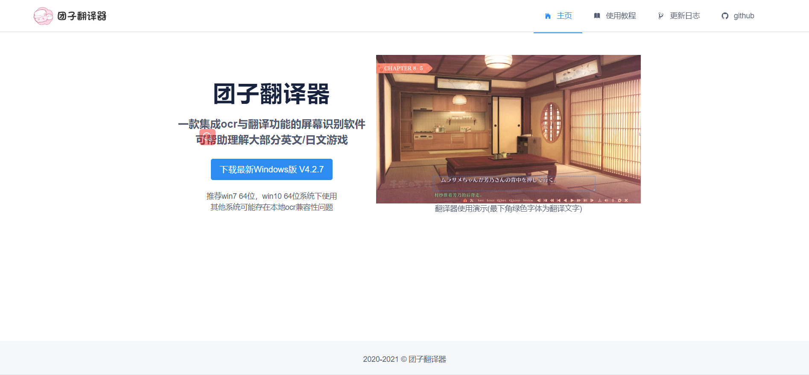

点击下载最新版本下载软件。

下载后得到exe文件：


安装软件：

运行-》安装-》确认位置-》安装即可

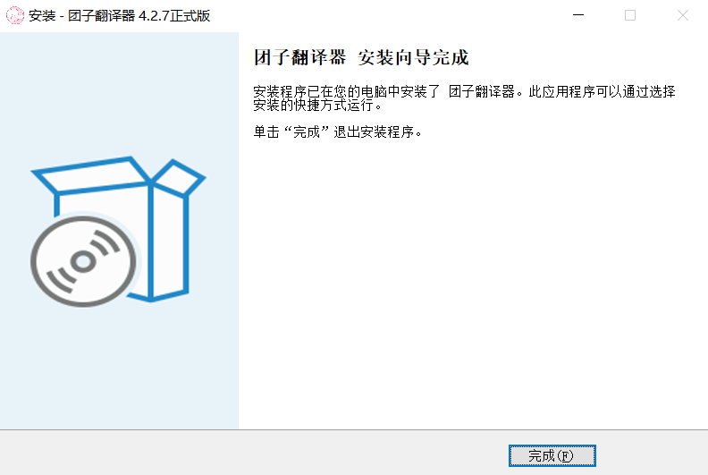

## 运行

点击运行即可。


## 注册

点击注册按钮，填写信息。当邮箱验证码填写完成即可注册成功。

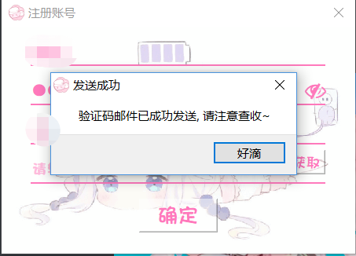

## 登录

当注册成功后直接点击登录即可（默认已经填写信息也可以手动输入）

## 自动设置

点击自动按钮即可，第一次可能需要比较长的时间请耐心等待！


## 手动设置

### OCR设置

经过踩坑以后小编发现手动需要先对ocr进行设置


首先点击框框设置按钮！

进入本体：

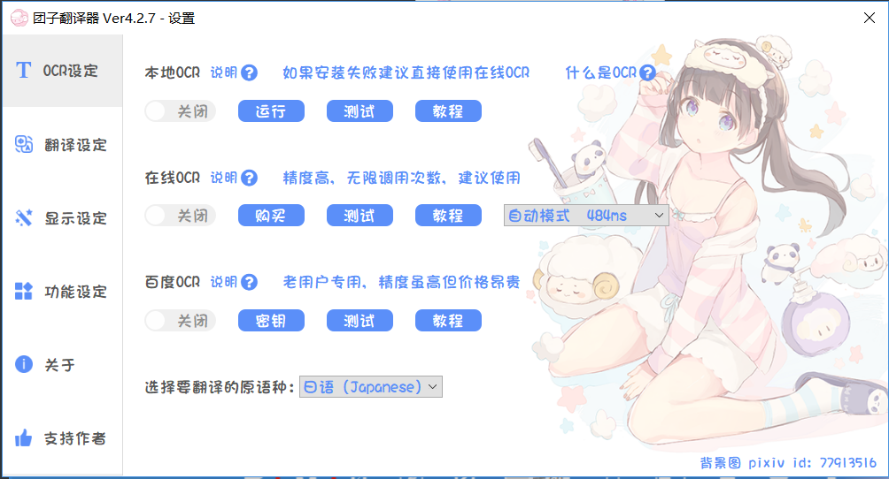

进行ocr设置点击开启即可。

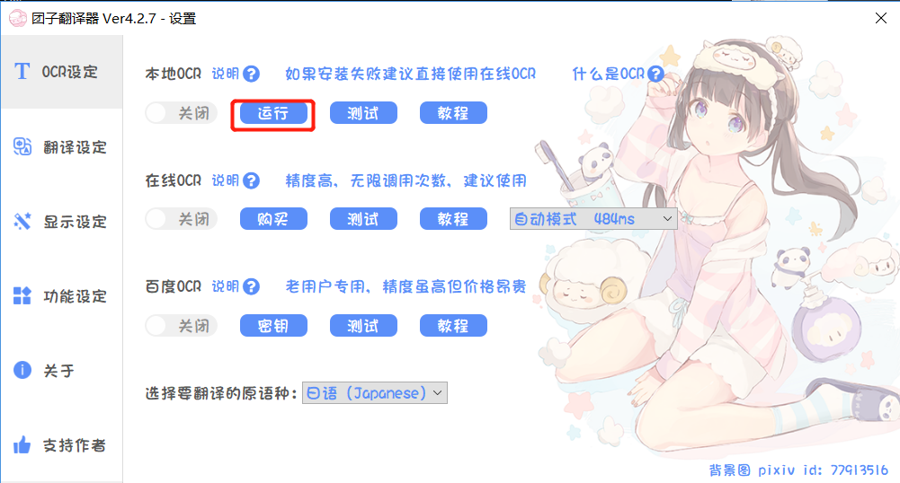

点击后会出现一团黑色的东东，不要着急也不要害怕，只要稍等片刻即可。

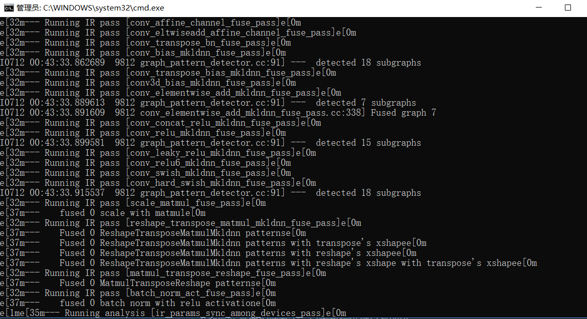

待到出现下列数据就可以点击测试：

```
 * Debug mode: off
 * Running on all addresses.
   WARNING: This is a development server. Do not use it in a production deployment.
 * Running on http://192.168.0.116:6666/ (Press CTRL+C to quit)
```

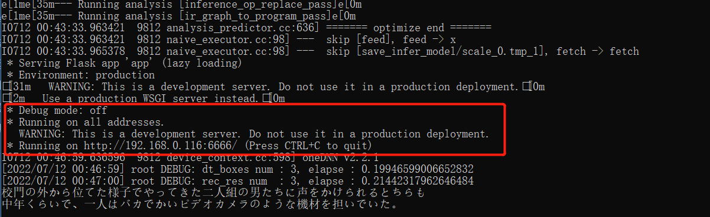

*   点击测试


出现测试成功即可

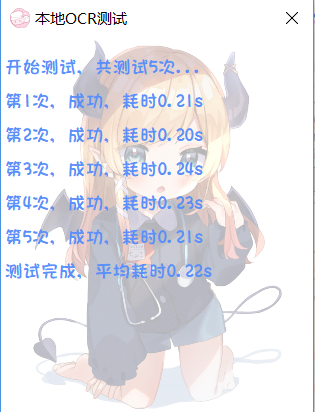

`在线使用`需要稍微氪金，点击教程进行查看即可。

`百度OCR` 如果是程序员/工程师或者对代码有使用了解的朋友可以使用百度ocr接口秘钥使用我们的百度ocr接口。


### 语言设置

通过下拉框对语言进行设置：


目前支持3种主流语言：

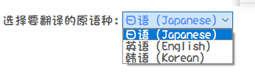

### 翻译设置

点击`翻译设置`，根据自己需要选择`公共翻译`和`私人翻译`。其中公共翻译最多可以选择3种，超过3种将会自行关闭最前面一种（请悉知）

私有翻译需要查看教程进行设置（ps：个人推荐公有即可）

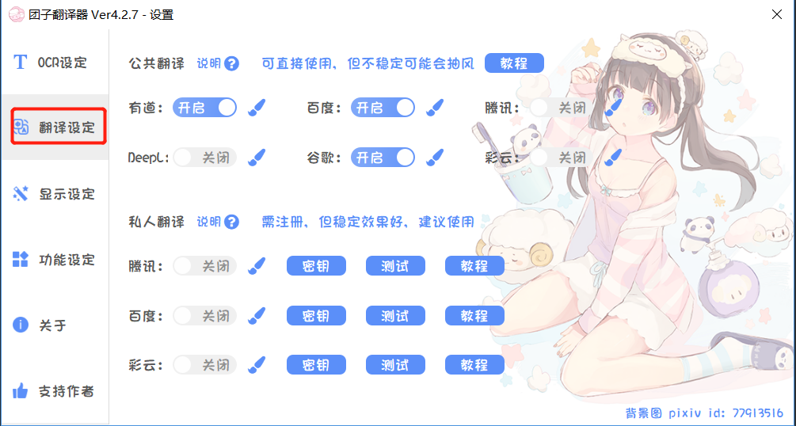


## 使用

点击框框中的内容，对需要翻译的位置进行选择。


选择后点击运行按钮，即可


## 其他功能

### 显示设置

对翻译框、字体大小，样式等都进行了设置。

还有翻译时间、颜色、隐藏范围等都进行了贴心设置。

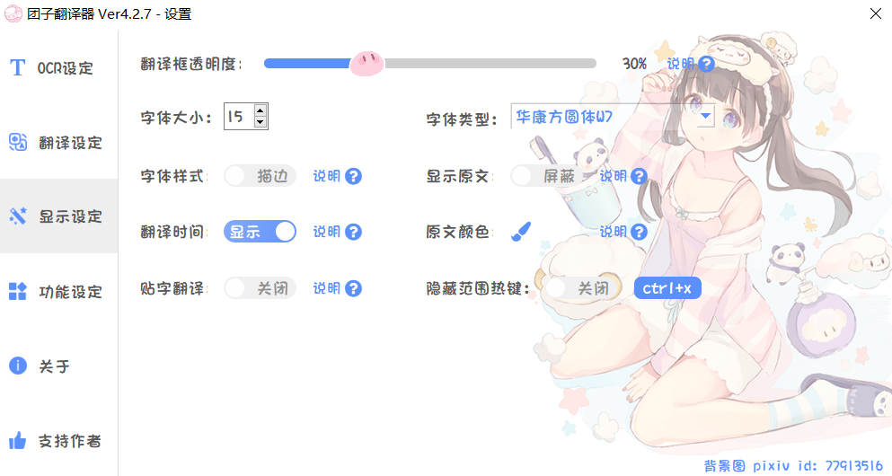

### 功能设定

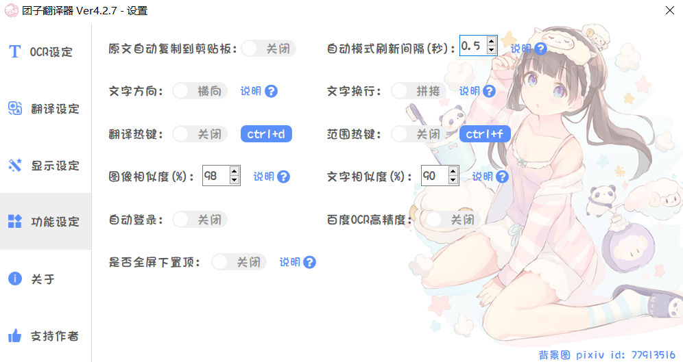

### 关于和支持作者

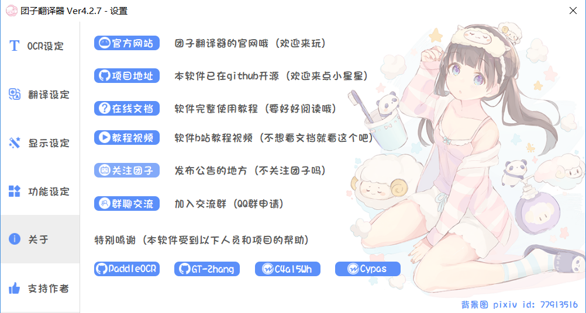


## 特殊情况

### OCR或翻译未开启

如下图情况：

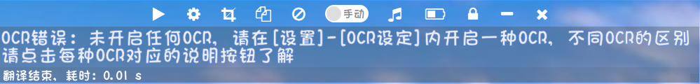

解决方案：

点击手动开启自动模式，或者点击设置按照手动设置方式进行处理。

### 定义为病毒无法打开

个别文件被定义为病毒无法打开。

处理办法：打开病毒管理软件，授权使用，同意该文件运行即可

### 本地ocr错误，端口被占用

具体情况如下图：


原因说明：

有可能是将cmd窗口意外关闭导致。

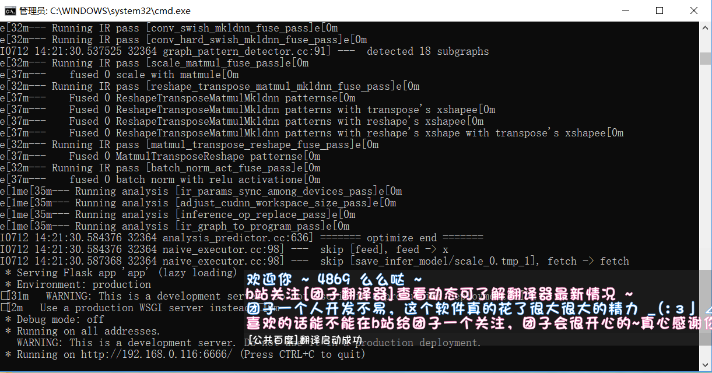

处理方法：

1、打开设置，手动打开本地OCR点击使用，然后稍等片刻即可

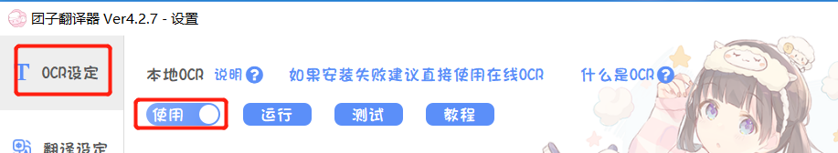

2、重启软件即可

## 详细文档：

参考地址：https://docs1.ayano.top/#/4.0/basic/start

